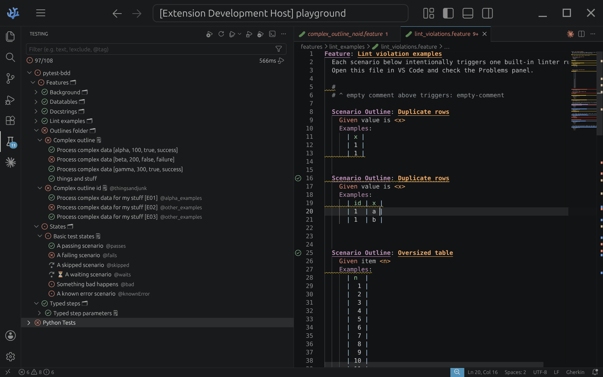
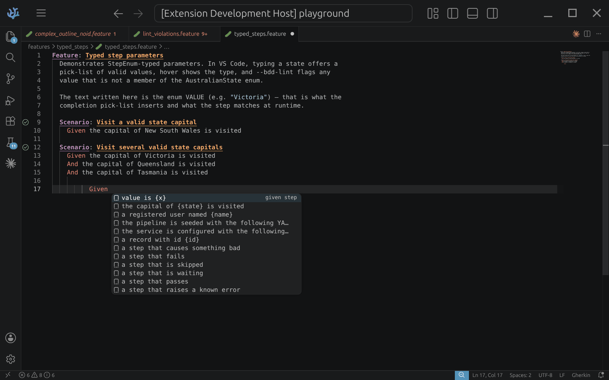
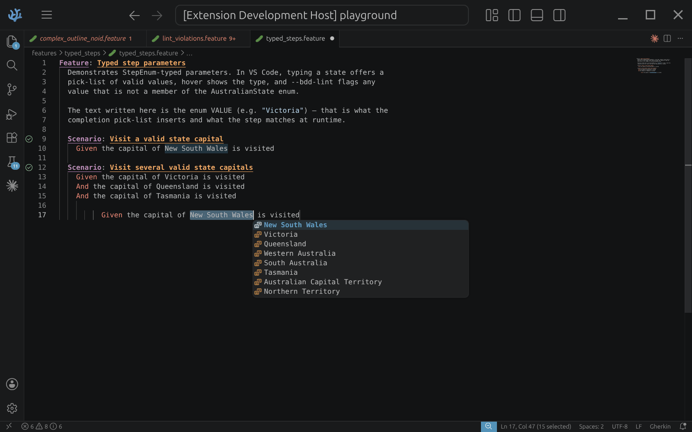
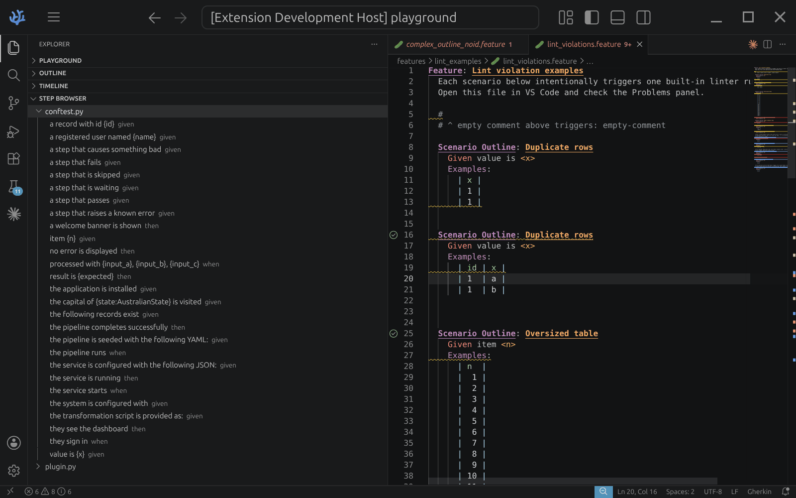
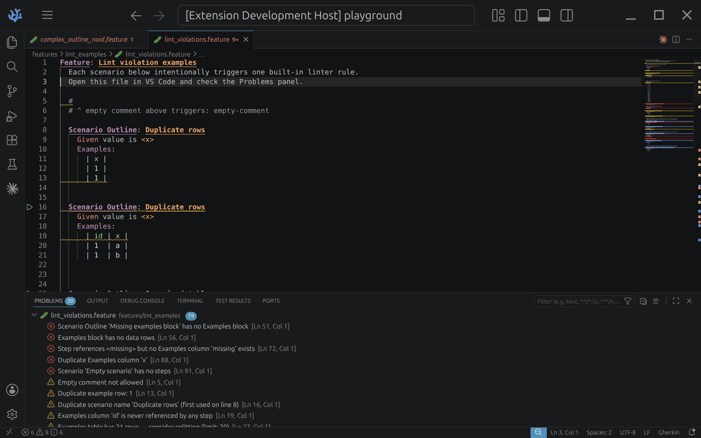

# Big Dill

**A pytest-bdd test runner and Gherkin authoring experience for VS Code.** Your `.feature` files become first-class citizens: scenarios appear in the Testing panel organised by feature — not by Python module — and testers get completions, hover docs, navigation, and instant linting while writing Gherkin.



## Why

VS Code's built-in Python test runner shows pytest-bdd scenarios as mangled Python function names (`test_complex_outline_with_custom_id_alpha_100_true_success_0`) buried in a module tree. The feature file is the specification — this extension puts it back at the centre:

- **Feature-file tree** — the Testing panel mirrors your `features/` folders, feature names, and scenario names from the Gherkin source
- **Scenario navigation** — click a scenario, jump to its line in the `.feature` file
- **Tags inline** — scenario and feature tags shown next to each item, filterable as `@bdd:tag`
- **Custom display names** — outline rows can show a meaningful identifier (e.g. `[E01]`) via a small hook in your `conftest.py`
- **Custom statuses** — map your own pytest outcomes (e.g. `waiting`, `knownError`) to VS Code run states

## Authoring support

- **Step completions** — `Ctrl+Space` shows matching steps ranked by usage
  
- **Typed parameters** — steps declared with an enum type offer a pick-list of exactly the valid values, and `pytest --bdd-lint` flags any value that isn't a member
  
- **Hover docs & Go to definition** — step signature and docs on hover; `F12` jumps to the Python implementation
- **Step Browser** — sidebar listing every step, grouped by file, step type, or tag
  
- **Linting as you type** — 13 structural rules (undefined/unused Examples columns, duplicate scenario names, empty scenarios, …), configurable tag and phrasing checks, and unimplemented-step warnings. Full list: [lint rules reference](https://github.com/nokout/pytest-bdd-orama/blob/main/docs/lint-rules.md)
  
- **Table formatting** — `Format Document` aligns datatable and Examples columns, right-aligning numeric columns; nothing outside table rows is touched
- **Syntax highlighting & snippets** — Gherkin keywords, tables, placeholders, embedded JSON/YAML/Python in docstrings

## Requirements

- Python **3.10+** with [`pytest`](https://pypi.org/project/pytest/), [`pytest-bdd`](https://pypi.org/project/pytest-bdd/), and the companion plugin [`pytest-big-dill`](https://github.com/nokout/pytest-bdd-orama/tree/main/pytest-plugin) installed in your project environment
- The [Python extension](https://marketplace.visualstudio.com/items?itemName=ms-python.python) (`ms-python.python`) — used for interpreter selection

## Quick start

1. Install this extension and select your project's Python interpreter (`Python: Select Interpreter`).
2. Install the companion pytest plugin into that environment.
3. Disable ms-python's own pytest tree to avoid duplicates, and point the extension at your pytest root if it isn't the workspace root:

```jsonc
// .vscode/settings.json
{
  "python.testing.pytestEnabled": false,
  "big-dill.enabled": true,
  "big-dill.cwd": "./tests-directory"   // optional
}
```

4. Open the Testing panel — your features appear, organised like your `features/` directory.

## Settings

All settings live under the `big-dill` namespace:

| Setting | Default | Description |
|---|---|---|
| `enabled` | `true` | Enable/disable the test runner |
| `cwd` | `""` | Working directory for pytest discovery and runs (falls back to `python.testing.cwd`, then workspace root) |
| `pytestArgs` | `[]` | Extra arguments for every pytest invocation |
| `outcomeMapping` | `{}` | Map custom status strings to VS Code run states (`passed`, `failed`, `errored`, `skipped`, `enqueued`) |
| `tagNamespace` | `"bdd"` | Prefix for Gherkin tags in the Test Explorer filter (`@bdd:smoke`) |
| `stepDefinitionGlob` | `{**/step_defs/**/*.py,…}` | Where to find Python step definitions; saves trigger step rediscovery |
| `allowedTags` | `[]` | If non-empty, unknown `@tags` are flagged |
| `phrasingRules` | `[]` | Regex rules against step text — enforce your team's Gherkin conventions |

## Security

This extension runs **pytest from your selected Python interpreter** to discover and execute tests — like any test runner, that executes your project's code (`conftest.py`, fixtures, step definitions). It spawns no other processes, makes no network requests, and collects no telemetry.

Because it executes workspace code, it declares `untrustedWorkspaces: false` and stays inactive in VS Code's Restricted Mode until you trust the folder.

Every release is built by a public GitHub Actions workflow and carries a signed build-provenance attestation, so you can verify a downloaded `.vsix` really came from this repository:

```bash
gh attestation verify big-dill-<version>.vsix --repo nokout/pytest-bdd-orama
```

Releases also ship a CycloneDX SBOM and SHA-256 checksums. To report a vulnerability, see [SECURITY.md](https://github.com/nokout/pytest-bdd-orama/blob/main/SECURITY.md).

## Learn more

- [Tester guide](https://github.com/nokout/pytest-bdd-orama/blob/main/docs/tester-guide.md) — writing features with the authoring tools
- [Developer guide](https://github.com/nokout/pytest-bdd-orama/blob/main/docs/developer-guide.md) — hookspecs: custom display names, statuses, typed steps, custom lint rules
- [Lint rules reference](https://github.com/nokout/pytest-bdd-orama/blob/main/docs/lint-rules.md)
- [Repository](https://github.com/nokout/pytest-bdd-orama) · [License](https://github.com/nokout/pytest-bdd-orama/blob/main/LICENSE) · [Third-party notices](https://github.com/nokout/pytest-bdd-orama/blob/main/THIRD-PARTY-NOTICES.md)

This extension is **source-available, not open source**. It is free to install
and use, including at work; redistributing or modifying it is not permitted.
